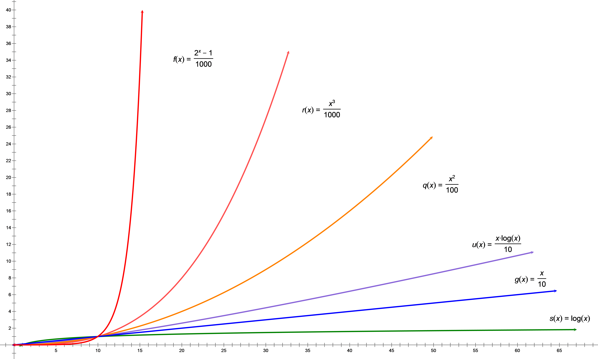

# 数据结构入门（Go语言描述）
　　我们将讨论几种经典数据结构的特点，但并不打算编写一部专著（毕竟已有珠玉在前）。相对于严谨的论证，这里更倾向于提供直观的描述。选用Go语言则有助于去繁就简。

## 所谓数据结构
　　我们说数据结构，指的是数据的**存储结构**和**逻辑结构**，以及维护和利用这些结构的**算法**。同一种的逻辑结构可以基于不同的存储结构，如各种堆；而同一种存储结构也可以有不同的逻辑结构，如有序数组和无序数组。接下来将展开讨论的链表和树侧重于其存储结构，堆和Hash表侧重于其逻辑结构，而数组和图则侧重于算法。

## 关于算法复杂度
　　谈到算法，就不可避免地要涉及算法复杂度的问题。  
　　所谓“算法复杂度”衡量的是算法的执行开销，而非实现上的难易。我们从时间和空间两方面讨论算法复杂度，这两方面的复杂度实际上分别反映了算法对处理器和存储器资源的消耗情况，而它们是执行算法的主要开销。在考虑算法平均开销的同时，经常还要考虑最坏情况下的开销，以便判断其是否能满足特定的应用场景。算法的空间复杂度通常显而易见，需要分析的往往是其时间复杂度。若无特殊说明，下文中“复杂度”一词特指时间复杂度。  
　　算法的复杂度一般与其所处理的数据规模呈正相关。我们设N为数据规模，k为正整数，那么常见的复杂度级别可表示为O(1)、O(logN)、O(Nk)、O(2N)，以及它们的组合（如O(NlogN) = O(N) × O(logN)）。当数据规模比较大时，不同级别间的差距相当惊人。如果说O(logN)是灶火，那么O(Nk)可比炸药，到O(2N)则堪比原子裂变了。至于O(1)，它比较特殊，表示开销与数据规模无关，是最低的一级。

下图显示了O(logN)、O(N)、O(NlogN)、O(N2)、O(N3)、O(2N)等级别函数的增长曲线。  

考虑到要系统地阐释复杂度理论需要相当的篇幅，我们在此点到即止，有兴趣的读者请自行补完。

---
[返回](../README.md)　[下一章](1.md)
