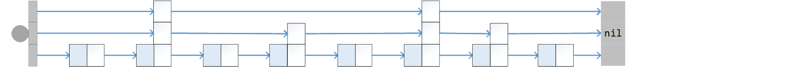

# 跳跃链表
普通链表在查找上没有什么优势，但只要经过适当的改造，链表也能有O(logN)级的查找性能。

## 多级链路


跳跃链表的特点在于其节点有若干个指针域，可以构成疏密不等的多级链路。
```go
	type node struct {
		next []*node			//若干个指针域
		key  int
	}
	type skipList struct {
		heads, knots []*node	//伪节点及暂存区
		cnt, level   int 		//非零，记录节点数目（含伪节点）和链路级别
		ceil, floor  int		//非零，用于标记该级容量的上下界
		rand         Random		//自带随机数发生器
	}
```

## 跳跃查找
利用多级链路，每次从稀疏的高级链路开始，跳跃前进：
```go
	func (l *skipList) Search(key int) bool {
		var knot = (*node)(unsafe.Pointer(l))
		for i := l.level - 1; i >= 0; i-- {
			for knot.next[i] != nil && knot.next[i].key < key {
				knot = knot.next[i]
			}
		}
		var target = knot.next[0]
		return target != nil && target.key == key
	}
```
我们通过5万数列的查找可以看出，这种跳跃式相对传统链表已经有了质的变化。

	LinkedList: 3.7722158s
	SkipList:   7.0004ms

## 投机者的胜利
　　跳跃链表的核心思想就是用不对称的节点构造多级链路，但是，怎么确定每个节点的级别呢？这个问题和数组快速排序中怎么确定分界点一样棘手。于是，从宏观上划定高级节点所占的比例之后，我们再次求助于骰子。
```go
	func (l *skipList) Insert(key int) bool {
		var knot = (*node)(unsafe.Pointer(l))
		for i := l.level - 1; i >= 0; i-- {
			for knot.next[i] != nil && knot.next[i].key < key {
				knot = knot.next[i]
			}
			l.knots[i] = knot
		}
		var target = knot.next[0]
		if target != nil && target.key == key { return false }

		l.cnt++
		if l.cnt == l.ceil {								//升级
			l.floor = l.ceil
			l.ceil *= LEVEL_FACTOR
			l.level++
			l.heads = append(l.heads, nil)
			l.knots = append(l.knots, (*node)(unsafe.Pointer(l)))
		}

		var lv = 1
		for lv < l.level &&
			l.rand.Next() <= (^uint32(0)/uint32(LEVEL_FACTOR)) {
			lv++											//投机决定节点级别
		}
		target = new(node)
		target.key = key
		target.next = make([]*node, lv)
		for i := 0; i < lv; i++ {
			target.next[i] = l.knots[i].next[i]
			l.knots[i].next[i] = target
		}
		return true
	}
```

## 高级话题
光凭O(logN)的平均查找性能，不足以让跳跃链表立足于强手之林。我们将在 [附录A](08-A.md) 中就此展开深入讨论。

---
[目录](../index.md)　[上一节](02-B.md)　[下一节](02.md)
