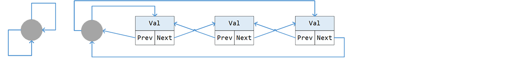

# 链表
 1. [链表的排序](02-A.md)
 2. [块链表](02-B.md)
 3. [跳跃链表](02-C.md)

___


　　链表与数组的基本功能类似，可是有更大的灵活性。链表不支持随机访问，在查找方面不如数组，但是在数组最头痛的插入和扩容问题上却处理得很好（O(1)时间）。

操作链表节点时，可以使用一种被称之为“伪节点”的技巧来简化表达。
```go
	//fake_head -> [...|next] -> first_node
	//                  head  -> first_node
	func FakeHead(spt **Node) *Node {
		var base = uintptr(unsafe.Pointer(spt))
		var off = unsafe.Offsetof((*spt).Next)
		return (*Node)(unsafe.Pointer(base - off))
	}
	func Merge(lst1 *Node, lst2 *Node) (list *Node) {
		var last = FakeHead(&list)
		for {
			last.Next = lst1
			if lst2 == nil { return list }
			for lst1 != nil && lst1.Val <= lst2.Val {
				last, lst1 = lst1, lst1.Next
			}
			last.Next = lst2
			if lst1 == nil { return list }
			for lst2 != nil && lst1.Val > lst2.Val {
				last, lst2 = lst2, lst2.Next
			}
		}
	}
```

## 双向链表及链环


　　链路也可以有多重。如果拥有方向相反的两重链路，那便是双向链表。我们通常把双向链表的头指针和尾指针打包成一个伪节点（环结），这样双向链表就构成了一个链环。
```go
	type NodeX struct {
		Prev, Next *NodeX
		Val        int
	}
	type Ring struct {
		tail, head *NodeX
	}

	func (r *Ring) asNodeX() *NodeX {
		return (*NodeX)(unsafe.Pointer(r))
	}
	func (r *Ring) Initialize() {
		r.head, r.tail = r.asNodeX(), r.asNodeX()
	}
	func (r *Ring) IsEmpty() bool {
		return r.head == r.asNodeX()
	}
```
双向链表的最大好处是删除节点特别方便：
```go
	func Release(node *NodeX) {
		node.Next.Prev = node.Prev
		node.Prev.Next = node.Next
	}
```

---
[返回目录](../index.md)
