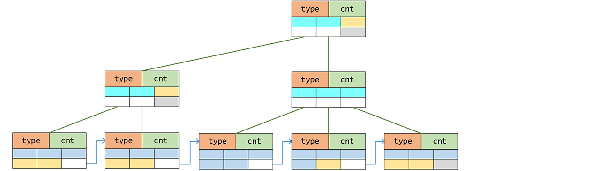

# B+树


在第二章中，我们讨论过改善链式结构存储友好性的办法（团块化），本节则要把它应用到树上面。
```go
	type node struct {				//原型
		inner bool
		cnt   int					//已用位置计数
		data  [0]int				//占位符号
	}
	type index struct {				//索引节点
		node 	//inner为true
		data [INDEX_FULL]int		//索引
		kids [INDEX_FULL]*index		//子节点指针域
	}
	type leaf struct {				//存储节点
		node	//inner为false
		data [LEAF_FULL]int			//负载
		next *leaf					//链表指针域
	}
```
　　B+树由索引节点和存储节点组成，是一种完美平衡的多叉树。其中，索引节点中的索引值为其对应子节点内容的最大值。而存储节点作为树的叶节点同时，还构成有序块链表。
```
		   [3  6  9]
		  /    |    \
	[1 2 3] [4 5 6] [7 8 9]
```

## 盈则分之
```
                                                                         [5 9]
                                                                         /   \
	   [3  6  9]         =>        [3     6     9]        =>        [3  5]   [6  9]
	  /    |    \                  /     / \     \            	    /   |     |   \ 
[0 1 2] [3 4 5] [6 8 9]      [1 2 3] [4 5] [5 6] [7 8 9]      [1 2 3] [4 5] [5 6] [7 8 9]
```
向已满节点插入新元素时，我们将该节点一分为二：
```go
	func (tr *Tree) Insert(key int) bool {
		if tr.root == nil {
			//...
		}

		tr.path.clear()
		var unit, place = (*leaf)(nil), 0

		var target = tr.root
		if key > tr.root.ceil() { 								//超出上界
			for target.inner {
				var idx = target.cnt - 1
				target.data[idx] = key 							//一路更新
				tr.path.push(target, idx)
				target = target.kids[idx]
			}
			unit, place = target.asLeaf(), target.asLeaf().cnt
		} else {
			for target.inner {
				var idx = target.locate(key)
				if key == target.data[idx] { return false }
				tr.path.push(target, idx)						//路径追踪		
				target = target.kids[idx]
			}
			unit, place = target.asLeaf(), target.asLeaf().locate(key)
			if key == unit.data[place] { return false }
		}

		var peer = unit.insert(place, key).asIndex()
		for peer != nil {										//分裂出新节点，继续
			if tr.path.isEmpty() {
				//...
			} else {
				var parent, idx = tr.path.pop()
				parent.data[idx] = target.ceil()
				target, peer = parent, parent.insert(idx+1, peer)
			}
		}
		return true
	}
```

## 亏则合之
```
         [4 9]                     [4 9]                   [4 9]
         /   \                     /   \                   /   \
    [2  4]   [6  9]      =>    [2 4]  [6  9]      =>     [4] [6  9]      =>     [4  6  9]
    /   |     |   \            /  |    |   \             /    |   \             /   |   \ 
[1 2] [3 4] [5 6] [7 8 9]  [1 2] [4] [5 6] [7 8 9]  [1 2 4] [5 6] [7 8 9]  [1 2 4] [5 6] [7 8 9]
```
删除元素后，我们尝试对残余数据量低的节点处理：和附近节点合并或者从附近节点分流数据。
```go
	func (tr *Tree) Remove(key int) bool {
		//...

		unit.remove(place)
		if tr.path.isEmpty() {									//对根节点采用直接删除
			if unit.cnt == 0 { tr.root, tr.head = nil, nil }
			return true
		} //除了到根节点，unit.cnt >= 2
		var shrink, new_ceil = (place == unit.cnt), unit.ceil()	//需要额外的索引修正

		parent, place := tr.path.pop()
		if unit.cnt <= LEAF_QUARTER {							//数据量少，考虑合并叶节点
			var peer = unit
			if place == parent.cnt-1 {							//向前
				unit = parent.kids[place-1].asLeaf()
			} else {											//向后
				place++
				peer, shrink = parent.kids[place].asLeaf(), false
			}
			var combined = unit.combine(peer)					//尝试合并
			parent.data[place-1] = unit.ceil()					//修正索引

			for combined {										//连锁
				var unit = parent								//对索引节点也如法炮制
				unit.remove(place)
				if tr.path.isEmpty() {							//对根节点采用缩节处理
					if unit.cnt == 1 { tr.root = unit.kids[0] }
					return true
				}
				parent, place = tr.path.pop()
				if unit.cnt <= INDEX_QUARTER {
					//（与叶节点合并类似）...
					continue
				}
				break
			}
		}
		if shrink { 											//合并已结束，但索引修正未完成
			parent.data[place] = new_ceil
			for place == parent.cnt-1 && !tr.path.isEmpty() {	//级联
				parent, place = tr.path.pop()	
				parent.data[place] = new_ceil
			}
		}
		return true
	}
```

## 性能分析
B+树是查询、插入、删除都为O(logN)的三好学生，只是节点的分裂与合并涉及数据挪移，有一定开销。

不过，在 [附录A](08-A.md) 中我们会看到，这点开销其实都是小儿科。

[目录](../index.md)　[上一节](05-B.md)　[下一节](05-D.md)
