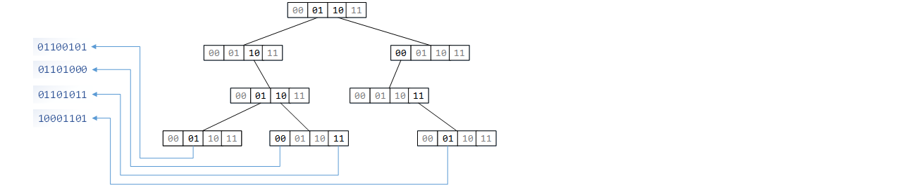

# 基数树


基数树就是一种简单有效的分级索引结构，每层索引为键值的一个片段。
```go
	type node struct {
		kids [KIDS_LIMIT]*node
	}
	func cut(key uint, i uint) uint {
		return (key >> ((UINT_LEN - STEP) - i*STEP)) & MASK
	}
```
基数树的操作比较简单，删除时注意级联处理就好。
```go
	func (tr *Tree) Remove(key uint) bool {
		var path [DEPTH]*node
		path[0] = &tr.root
		for i := uint(0); i < DEPTH-1; i++ {
			path[i+1] = path[i].kids[cut(key, i)]
			if path[i+1] == nil { return false }
		}
		var idx = key & MASK
		if path[DEPTH-1].kids[idx] == nil { return false }
		path[DEPTH-1].kids[idx] = nil
		for i := DEPTH - 1; i != 0; i-- {
			var j = uint(0)
			for j < KIDS_LIMIT && path[i].kids[j] == nil { j++ }
			if j == KIDS_LIMIT { //全空
				path[i-1].kids[cut(key, i-1)] = nil
			}
		}
		return true
	}
```

## 字典树


　　字典树又称前缀树，是一种针对序列的索引结构。字典树的基本原理和基数树一样，不过由于序列长度并不固定，情况要更加复杂一些。另一方面，我们通常希望数据单元是有意义的片段（不宜小于一字节），导致节点的后继可能较多，故如何获得较好的空间利用率也是一项挑战。字典树节点的结构有多种，各有千秋，而这里介绍的一种分离指针数组结构则兼顾了便捷与效能。
```go
	type node struct {
		key  [NODE_CAP]byte		//保存若干数据单元
		cnt  uint8				//所保存数据单元个数
		ref  uint16				//标记以此节点结尾的序列出现的次数
		kids []*node			//下游指针
	}
```
字典树的插入相对容易，而删除则要考虑删除非共享序列片段（只清空引用数也行，但会留下冗余数据）。
```go
	func (root *node) Remove(str string, all bool) {
		if len(str) == 0 { return }
		var knot, branch = (*node)(nil), 0 						//记录分支点
		var mk = uint8(0)
		for idx := 0; idx < len(str); idx++ {
			if mk == root.cnt { 								//下探
				var spot = root.searchKid(str[idx])
				if spot == len(root.kids) ||
					root.kids[spot].key[0] != str[idx] { return }
				if root.ref != 0 || len(root.kids) > 1 {
					knot, branch = root, spot					//最近分支点
				}
				root = root.kids[spot]
				mk = 1
			} else {
				if root.key[mk] != str[idx] { return }
				mk++
			}
		}
		if mk != root.cnt || root.ref == 0 { return }
		if all { root.ref = 0
		} else { root.ref-- }
	
		if root.ref == 0 && len(root.kids) == 0 {				//删除独苗
			for i := branch + 1; i < len(knot.kids); i++ {
				knot.kids[i-1] = knot.kids[i]
			}
			knot.kids = knot.kids[:len(knot.kids)-1]
		}
	}
```
插入和删除都有可能造成序列的碎片化，我们需要在搜索时设法整理。
```go
	func (root *node) Search(str string) uint16 {
		var mk = uint8(0)
		for idx := 0; idx < len(str); idx++ {
			if mk == root.cnt {
				if len(root.kids) == 1 && root.ref == 0 && root.cnt < NODE_CAP {
					root.consume(root.kids[0])					//向前合并
				} else {
					var spot = root.searchKid(str[idx])
					if spot == len(root.kids) ||
						root.kids[spot].key[0] != str[idx] { return 0 }
					root = root.kids[spot]
					mk = 1
					continue
				}
			}
			if str[idx] != root.key[mk] { return 0 }
			mk++
		}
		if mk != root.cnt { return 0 }
		return root.ref
	}
```

---
[目录](../index.md)　[上一节](05-D.md)　[下一节](05.md)