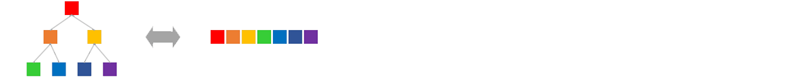

# 二叉堆


二叉堆并没有使用传统的树状储存结构，而是选用基于数组的树状逻辑结构。

## 浮沉
我们知道堆是有序列的汇流，需要维护这些子列的有序性。本节中，我们用冒泡法来维护子列的有序性。
```
		  2                    2                    1               2      2      1
		/   \                /   \                /   \             |      |      |
	  4       5     =>     4       1     =>     4       2           5  =>  1  =>  2
	 / \     / \          / \     / \          / \     / \          |      |      |
	9   7   6  _1_       9   7   6   5        9   7   6   5         1      5      5
```
子列的长度只有O(logN)级，上浮用时为O(logN)级。
``` 
		 _7_                   2                    2               7      2      2
		/   \                /   \                /   \             |      |      |
	  2       5     =>     7       5     =>     4       5           2  =>  7  =>  4
	 / \     / \          / \     / \          / \     / \          |      |      |
	9   4   6   8        9   4   6   8        9   7   6   8         4      4      7
``` 
下沉过程，先要进行一次横向比较以确定路径，故比较次数为O(2logN)。

## 垒叠
我们可以采用自底向上的方法，在一个无序数组的基础上创建二叉堆：
```go
	func (hp *Heap) Build(list []int) {
		var size = len(list)
		hp.core = list
		for idx := size/2 - 1; idx >= 0; idx-- {
			hp.adjustDown(idx)
		}
	}
```
建堆的复杂度只有O(N)：

	设建立高度为logX的二叉堆的耗时为O(f(logX))，则f(logX+1) = 2f(logX) + 1
	显然f(0) = 0，于是可归纳得f(logX) = X - 1

## 压入 & 弹出
二叉堆的压入，就是在尾部添加新元素，然后对其进行调整：
```go
	func (hp *Heap) Push(key int) {
		var place = len(hp.core)
		hp.core = append(hp.core, key)
		hp.adjustUp(place)									//上浮
	}
```
二叉堆在弹首元素后，我们抽调尾元素来补缺，然后对其进行调整：
```go
	func (hp *Heap) Pop() (int, error) {
		var size = hp.Size()
		if size == 0 { return 0, errors.New("empty") }

		key = hp.core[0]
		if size == 1 {
			hp.core = hp.core[:0]
		} else {
			hp.core[0] = hp.core[size-1]
			hp.core = hp.core[:size-1]
			hp.adjustDown(0)								//下沉
		}
		return key, nil
	}
```

## 堆排序
我们可以用二叉堆来改进选择排序，把复杂度降到O(NlogN)：
```go
	func HeapSort(list []int) {
		BuildMaxHeap(list)									//建立最大堆
		for sz := len(list) - 1; sz > 0; sz-- {
			list[sz] = Pop(list[:sz+1])						//不断选出剩余部分中的最大值
		}
	}
```
　　堆排序的核心在于系列下沉操作，其总比较次数为O(2NlogN)，不如归并排序和快速排序。虽然建堆的开销也有影响，但堆排序比同行慢的主要原因还是每回多出的一次比较，以及其不规则的访存轨迹。

---
[目录](../index.md)　[上一节](06.md)　[下一节](06-B.md)
